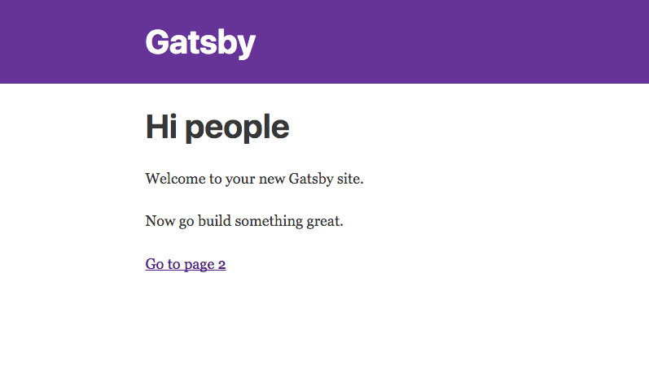

[Gatsby](https://www.gatsbyjs.org/) is a static site generator built with React, Redux, and Webpack.
Like [Jeckyll](https://jekyllrb.com/), but with modern JS instead of Ruby.

In the next few posts, we'll walkthough how to set up your own website/blog using Gatsby.

Topics we'll cover in this post
- Initializing a new static site
- Adding new pages

Some of this information is in the [official documentation](https://www.gatsbyjs.org/docs/).
Unfortunately, since this is a somewhat new project, there are still some holes.

## Prerequisites

You'll need
- Familiarity with ES6 JavaScript and React
- [Node](https://nodejs.org/en/) and NPM installed

## Initializing the Project

First install Gatsby

```bash
npm install -g gatsby

```

Then use it to create a new project

```bash
# replace "site-name" with the name of the
# directory you want the project to live in
gatsby new site-name
```

This will create a new react project in the directory `site-name`. That directory should
have the following structure

```
LICENSE
gatsby-config.js  # Contains config information for Gatsby
packag.json
src/ # Most of the project is in this folder
  layouts/
  pages/
README.md
node_modules
public
```

No you can the command `yarn develop` (or `node develop` if not using yarn) to serve the app at localhost:8000 in
development mode. You should see



"Development mode" will hotload any changes you make,
except for changes made to config files (`package.json`, `gatsby-config.js`, or `gatsby-node.js`).

## Adding a New Page

To create a new page on the site, create a new `js` file in the `src/pages` directory,
and export a React component from that file. Gatsby will create a new route based on the name of the file, and render the component based on the layout defined in `src/layouts/index.js`

To see an example, save the following code into `src/pages/my-new-page.js`:

```jsx
import React from 'react'

export default function MyNewPage () {
  return (
    <div>
      <h1>My New Page</h1>
      <p>
        I just added a new page to my site. Cool!
      <p>
    </div>
  )
}
```

We can see this page by visiting `localhost:8000/my-new-page`.


### Linking to a Different Page

If you need to link to a different page, use the component `gatsby-link`.

```jsx
import React from 'react'
import Link from 'gatsby-link'

export default function MyNewPage () {
  return (
    <div>
      <h1>My New Page</h1>
      <p>
        I just added a new page to my site. Cool!<br />
        <Link to="/">Back to the index</Link>
      <p>
    </div>
  )
}
```

## Adjusting the Layout

The file `src/layouts/index.js` contains the default layout. Anytime component exported from the `src/pages` directory gets passed into the layout compont as `children` props.

### Changing CSS

The default stylesheet lives in `src/layouts/index.css`. Any CSS added here will automatically be available in your application.

### Adding Resources

Because Gatsby is built with Webpack, you can fonts, images, and other resources as if they were a regular file import.

```jsx
import React from 'react'

// Importing tells webpack to include this resource.
// The import result will be a string respresenting the path
// to the resource
import logo from './logo.png'

function Header () {
  return 
}
```

## Building the Site

Once you're ready to deploy the site, run `yarn build`. The result of the build will be
placed in the `public` folder. Deploy the contents of this folder to a host of your
choice.

### Testing the Build

If you'd like to test your build before deploying, you can run `gatsby serve`.

I like to add the command as a npm script to `package.json`

```js
"scripts": {
  "build": "gatsby build",
  "develop": "gatsby develop",
  "serve": "gatsby serve"
}
```

That should get you started. In our next post, we'll add the ability to create posts from markdown.
