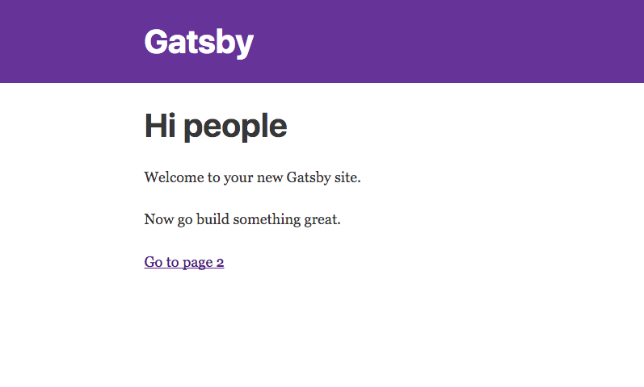

[Gatsby](https://www.gatsbyjs.org/) is a static site generator build with React, Redux, and Webpack.
Like [Jeckyll](https://jekyllrb.com/), with modern JS instead of Ruby.

In the next few posts, we'll walkthough how to set up your own website/blog using Gatsby.

Things we'll cover
- Initializing a new static site
- Adding new pages
- Creating Layouts
- Adding markdown support / automatic post creation for markdown files
- Deploying to Github Pages

Much of this is layed out in the [official documentation](https://www.gatsbyjs.org/docs/).
Unfortunately, since this is relatively new project, there are still some holes.

## Prerequisites

You'll need
- Familiarity with ES6 JavaScript
- [Node](https://nodejs.org/en/) and NPM installed

## Initializing the Project

First you'll need to install Gatsby

```sh
npm install -g gatsby

```

Then use it to create a new project

```sh
gatsby new <site-name>
```

This will create a new react project with the following scripts defined in `package.json`:

```javascript
"scripts": {
  "build": "gatsby build",
  "develop": "gatsby develop",
  // ...
}
```

Running `npm develop` will serve the app at localhost:8000.



